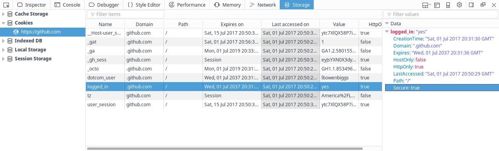

Cookies
=======

This document is a high-level overview of browser cookies. It also explains how to view and edit them from the browser.

# What is a Cookie?
Cookies are data stored locally by the browser. They are used to keep track of user state, such as language preferences or session ID. They are given to the user by the server and stored in the browser. Cookies can be persistent and last after the browser is exited.

## 3rd Party Cookies
Cookies have a `domain` attribute which normally matches the website that the user is visiting. If it does not, the cookie is called a 3rd party cookie. This often happens when advertisements or 3rd party content is hosted on a webpage, and are used to track browsing history of the user.

You can disable 3rd party cookies. In Firefox, Go to **Preferences**. In the **Privacy** tab, under the **History** heading, select **Never** from the "Accept cookies from sites" checkbox.

In Chrome, go to the **Settings** page click "Show advanced settings...". Under **Privacy**, click "Content settings..." and check "Block third-party cookies and site data" (under **Cookies**).

# Viewing and Editing Cookies from the Browser
## Firefox

In Firefox, you can view cookies through the Storage inspector developer tool. The left pane shows the different types of storage. The middle pane lists all the cookies from this site. The right pane shows the details of the currently selected cookie.

In the example, you can see 9 cookies. The "Expires On" column shows when the cookie (should) be discarded. The "Value" column shows what the cookie is set to. The currently selected cookie, `logged_in` is set to `yes`. In the details pane, you can see when it was created, when it expires, and a few more details.

To Modify the value of the cookie, double click in the "Value" column and type in a new value. You can also delete the cookies by right clicking and selecting to delete the individual cookie, all cookies, or all cookies from that domain.
